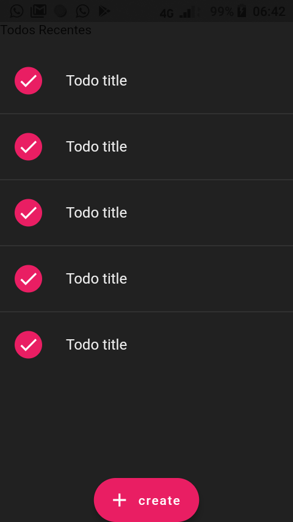
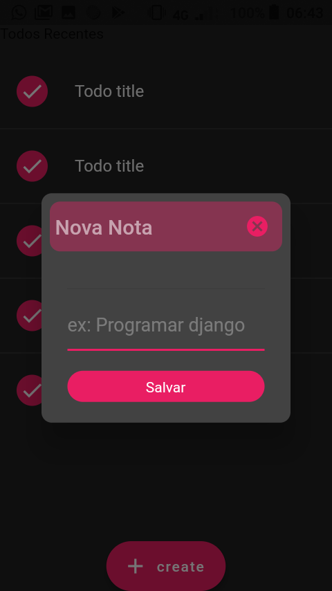
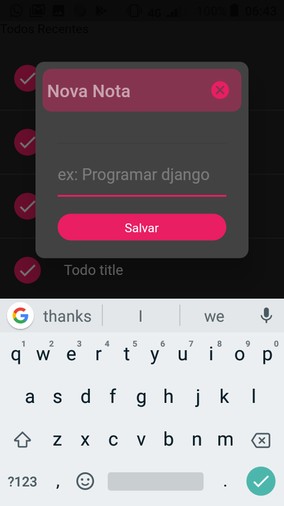

# flutfirebase
Meu flutter app com firebase


Gerar SHA-1 no terminal para firbase android 

Go to the project folder in the terminal.

Mac keytool -list -v -keystore ~/.android/debug.keystore -alias androiddebugkey -storepass android -keypass android

Windows keytool -list -v -keystore "\.android\debug.keystore" -alias androiddebugkey -storepass android -keypass android

Linux keytool -list -v -keystore ~/.android/debug.keystore -alias androiddebugkey -storepass android -keypass android

acaba com as recomendacoes do firbase e por fim as dependecias que seram instaladas atraves do pubspec.yaml
```yaml
dependencies:
    # [recomendado] se nao da um problema se nao colocar na sua dependencia
    firebase_core: ^1.4.0 
    cloud_firestore: ^2.4.0
    firebase_storage: ^10.0.0

```

SE for a rodar pela primeira vez possa vir dar erro de Dex
que quer dizer os codigos java quando compilados geram um arquivo .jar e 
flutter gera um arquivo .dex e firbase gerar arquivos dex maiores e k ests sao limitado
dai da um pau , para solucionar esse trouble precisar settar :

android/app/build.gradle
```groove
dependencies {
    def multidex_version = "2.0.1"
    implementation "androidx.multidex:multidex:$multidex_version"
}
```
If you aren't using AndroidX, add the following deprecated support library dependency instead:
```groove

dependencies {
    implementation 'com.android.support:multidex:1.0.3'
}
```
 e no mesmo grandle do android/app/
 adicione no defaultConfig que multiDexEnabled=true
```groove

android {
    defaultConfig {
        ...
        minSdkVersion 15 
        targetSdkVersion 28
        multiDexEnabled true
    }
    ...
}

dependencies {
    implementation "androidx.multidex:multidex:2.0.1"
}


```

Iniciando a estrutura do projecto

[-] feita a criacao da estrutura de Getx_pattern

[+] como vou interagir com cloud_firestore [que eh um banco de dado rectivo do firebase ]
 [-] primeiro estarei criando uma interface de repository que ele sera capaz de ter todos os metodos para se interagir com firabase [buscar os dados no banco ]
 e ele 'e um  banco reactivo por isso usarei streams

 ```dart
 'lib/app/data/repositories/todo_repository_interface.dart'

import 'package:flutfirebase/app/data/models/todo_model.dart';

abstract class IFirestoreTodoRepository {
  /** Interface que tera todos os metods para se comunicar com o banco reactivo do firebase [Cloud_firestore]

  **/
  // como ele 'e um banco de daos reactivo usarei streams na hora  de pegas os dados
  Stream<List<TodoModel>> getTodos();
}


```

# e sua Classe Repository que a implementa fica 
```dart
'lib/app/data/repositories/todo_repository.dart'

import 'package:flutfirebase/app/data/models/todo_model.dart';

import 'todo_repository_interface.dart';

class FireStoreTodoRepository implements IFirestoreTodoRepository {
  @override
  Stream<List<TodoModel>> getTodos() {
    // TODO: implement getTodos
    throw UnimplementedError();
  }
}


```

```dart
'TodoModel 
o modelo tera um metodo factory que alem fromJson tera um fromDocumets a referir documents do firestore'

import 'package:cloud_firestore/cloud_firestore.dart';

class TodoModel {
  String? uid;
  String title;
  bool checked;
  final DocumentReference? reference; //areferencia

  TodoModel(
      {this.reference, this.uid, required this.title, required this.checked});

  factory TodoModel.fromDocumets(
      DocumentSnapshot<Map<String, dynamic>> firestore_docus) {
    // este firestore_docus aparecera em formato json
    // dai que eu acessarei com map
    return new TodoModel(
        checked: firestore_docus['checked'],
        title: firestore_docus['title'],
        reference: firestore_docus['reference']!);
  }

  Map<String, dynamic> toJson() =>
      {'title': title, 'reference': reference!, 'checked': checked};
}


 ```

# TodoPage Contem dissible Widget
 

 ```dart
 return Scaffold(
      // appBar: AppBar(
      //   title: Text('ALL TODOS'),
      // ),
      resizeToAvoidBottomInset: false,
      body: SafeArea(
        child: Column(
          mainAxisSize: MainAxisSize.min,
          crossAxisAlignment: CrossAxisAlignment.stretch,
          children: [
            Text('Todos Recentes'),
            SizedBox(height: 20),
            // Spacer(),
            ListView.separated(
                separatorBuilder: (_, index) => Divider(
                      color: Colors.grey[800],
                    ),
                shrinkWrap: true,
                itemCount: 5,
                itemBuilder: (ctx, index) {

                  <!-- Aplicando dissmisble WIgets -->
                  
                  return Dismissible(
                    background: Container(
                      padding: EdgeInsets.only(left: 20),
                      alignment: Alignment.centerLeft,
                      color: Colors.redAccent,
                      child: Icon(
                        Icons.delete,
                        color: Colors.grey[200],
                      ),
                    ),
                    key: Key(index.toString()),
                    onDismissed: (direction) {
                      switch (direction) {
                        case DismissDirection.startToEnd:
                          {
                            print('removed');
                          }
                          break;
                      }
                    },
                    child: ListTile(
                      onTap: () {},
                      leading: Container(
                        height: 30,
                        width: 30,
                        // alignment: Alignment.center,
                        // padding: EdgeInsets.all(2),
                        decoration: BoxDecoration(
                          color: Theme.of(ctx).primaryColor,
                          shape: BoxShape.circle,
                        ),
                        child: Icon(
                          Icons.check,
                          color: Colors.white,
                        ),
                      ),
                      title: Text(
                        'Todo title',
                        style: TextStyle(
                          color: Colors.grey[200],
                        ),
                      ),
                    ),
                  );
                })
          ],
        ),
      ),


 ```

 # on Add new Task open popup 
 


 ```dart
 floatingActionButton: FloatingActionButton.extended(
        onPressed: () {
          showDialog(
            context: context,
            barrierDismissible: false,
            builder: (_) => SimpleDialog(
              contentPadding:
                  EdgeInsets.symmetric(horizontal: 25, vertical: 20),
              backgroundColor: Colors.grey[800],
              shape: RoundedRectangleBorder(
                borderRadius: BorderRadius.circular(10),
              ),
              titlePadding: EdgeInsets.all(8),
              title: Container(
                padding: EdgeInsets.only(left: 5),
                decoration: BoxDecoration(
                  color: Theme.of(context).primaryColor.withOpacity(0.4),
                  borderRadius: BorderRadius.circular(10),
                ),
                child: Row(
                  children: [
                    Text(
                      'Nova Nota',
                      style: TextStyle(
                        color: Colors.white54,
                      ),
                    ),
                    Spacer(),
                    IconButton(
                        icon: Icon(Icons.cancel,
                            color: Theme.of(context).primaryColor),
                        onPressed: () {
                          Get.back();
                        }),
                  ],
                ),
              ),
              children: [
                Divider(),
                TextFormField(
                  controller: controller.title_edit.value,
                  autofocus: true,
                  maxLines: 2,
                  autofillHints: ['saidino', 'hacker', 'claudia', 'Mariamo'],
                  style:
                      TextStyle(color: Colors.white, height: 1.5, fontSize: 18),
                  decoration: InputDecoration(
                    hintText: 'ex: Programar django ',
                    hintStyle: TextStyle(
                      color: Colors.white30,
                    ),
                  ),
                ),
                SizedBox(height: 20),
                SizedBox(
                  height: 30,
                  width: size.width,
                  child: TextButton(
                    style: TextButton.styleFrom(
                      backgroundColor: Theme.of(context).primaryColor,
                      shape: RoundedRectangleBorder(
                        borderRadius: BorderRadius.circular(20),
                      ),
                    ),
                    child: Text(
                      'Salvar',
                      style: TextStyle(
                        color: Colors.white,
                        fontWeight: FontWeight.w400,
                      ),
                    ),
                    onPressed: () {},
                  ),
                ),
              ],
            ),
          );
        },
        label: Text('create'),
        icon: Icon(Icons.add),
      ),

 ```
 # when focussed the dialog
 


 # FIREBASFIREESTORE BASICS

 # exemplo completo

 #  A CLASE CONTROLLER DEST WIDGET QUE GUARDA A REFENCIA DO todo de la no firestore.
 ```dart
class TodoController extends GetxController {
  final title_edit = TextEditingController().obs;
  TodoRepository repository = TodoRepository();
  void saveTodo() {
    if (title_edit.value.text.isNotEmpty) {
      Get.snackbar(
        'Edited',
        '${title_edit.value.text}',
        backgroundColor: Colors.grey[800],
      );
    }
  }

  Future<void> showData() async {
    var data = repository.getTodos();
  }
}


 ```

 # O WIDGET COMPLETO COM AS PARTES DO TODO

 ``` dart

  @override
  Widget build(BuildContext context) {
    var primaryColor = Theme.of(context).primaryColor;
    return Scaffold(
      appBar: AppBar(
        title: TextField(
          controller: controller.titleEditctl,
        ),
        actions: [
          IconButton(
            onPressed: () => Get.toNamed(AppRoutes.TODO),
            icon: Icon(Icons.file_present),
          ),
        ],
      ),
```
# PARA SER RECUSIVO USAMOS O STREAM BUILDER PARA COMUNICAR EM TEMPO REAL COM BANCO DE DADOS
```dart

      body: SafeArea(
        child: StreamBuilder(
            // stream: FirebaseFirestore.instance.collection('todo').snapshots(),
            // como ja criei refencia d todo no homeController entao posso usalo
            stream: controller.todoReference.orderBy('title').snapshots(),
            builder: (ctx, AsyncSnapshot<QuerySnapshot> snapshot) {
              if (!snapshot.hasData)
                return Center(child: CircularProgressIndicator.adaptive());
              return ListView(
                children: snapshot.data!.docs.map((todo) {
                  return Dismissible(
                    background: Container(
                      alignment: Alignment.centerLeft,
                      decoration: BoxDecoration(color: primaryColor),
                      child: Icon(
                        Icons.delete,
                        color: Colors.grey[800],
                      ),
                    ),
```
# ACACO PARA APAGAR DO FIRESTORE
```dart

                    key: Key("${todo['title']}"),
                    onDismissed: (direction) {
                      controller.todoReference.doc(todo.id).delete();
                      Get.snackbar('Delecao', 'Deletado com sucesso',
                          backgroundColor: Colors.white);
                    },
                    child: ListTile(
                      title: Text(
                        "${todo['title']} + ${todo['checked']}",
                        style: TextStyle(color: Colors.white30),
                      ),
```
# ACAO PARA ACTUALIZAR NO FIRESTORE

```dart
                      leading: Checkbox(
                        value:
                            todo['checked'].toString().trim().toLowerCase() ==
                                    'true'
                                ? true
                                : false,
                        // == 'false'? true : false,
                        //parse(todo['checked']),
                        onChanged: (v) {
                          bool todo_checked =
                              todo['checked'].toString().trim().toLowerCase() ==
                                      'true'
                                  ? true
                                  : false;
                          controller.todoReference
                              .doc(todo.id)
                              .update({'checked': !todo_checked})
                              .then(
                                (value) => Get.snackbar(
                                  'Updating',
                                  'check updated sucessfull',
                                  backgroundColor: Colors.blueAccent,
                                ),
                              )
                              .catchError((error) {
                                Get.snackbar('Update',
                                    'Erro ao fazer update por favor verifique o database',
                                    backgroundColor: primaryColor);
                              });
                        },
                      ),
                      onLongPress: () {
                        // Apage ao precionar com alta preesao
                      },
                    ),
                  );
                }).toList(),
              );
            }),
      ),
```
# ACAO PARA ADICIONAR UM NOVO DADO NO FIRESTORE

```dart
      floatingActionButton: FloatingActionButton(
        onPressed: () {
          if (controller.titleEditctl.text.isNotEmpty) {
            controller.todoReference.add({
              'title': controller.titleEditctl.text,
              'checked': false,
            });
          }
          controller.titleEditctl.clear();
        },
        child: Text('Add'),
      ),
    );
  }
}

 ```


# UTILS  [1] HOW TO CREATE ClipPath in Widget

```dart
ClipPath(
            clipper: HomeTopCustomPainter(),
            child: Container(
              height: size.height * 0.5,
              width: double.infinity,
              decoration: BoxDecoration(
                  gradient: LinearGradient(
                      end: Alignment.bottomLeft,
                      begin: Alignment.topRight,
                      colors: [
                    Color(0xFF3383CD),
                    Color(0xFF11249F),
                  ])),
              child: Column(
                children: [
                  Container(
                    height: kToolbarHeight,
                    child: Text('Well come'),
                  ),
                  Row(
                    children: [
                      Padding(
                        padding: const EdgeInsets.all(20.0),
                        child: Container(
                          width: size.width * 0.7,
                          height: 34,
                          child: TextField(
                            style: TextStyle(color: Colors.white),
                            decoration: InputDecoration(
                              filled: true,
                              fillColor: Colors.white24,

                              suffixIcon: Padding(
                                padding: EdgeInsets.all(5),
                                child: Icon(Icons.search),
                              ),
                              // focusedBorder: InputBorder.none,
                              border: OutlineInputBorder(
                                borderSide: BorderSide.none,
                                borderRadius: BorderRadius.circular(20),
                              ),
                            ),
                          ),
                        ),
                      ),
                      Expanded(
                        child: Icon(Icons.scatter_plot_outlined,
                            color: primaryColor),
                      ),
                    ],
                  )
                ],
              ),
            ),
          ),
```


# AUTHETICACOA COM GOOGLE SIGN E FIREBASE-AUTH
Para amais explicacoes
!()[https://www.youtube.com/watch?v=1k-gITZA9CI]

Neste projecto adicionei as dependencias :
```dart
# google sign
  firebase_auth: ^3.0.1
  google_sign_in: ^5.0.5

  #Google Icon
  font_awesome_flutter: ^9.1.0
```
para tal efeito e isso so sera possivel se adicionar nas configuracoes do porjecto no firebase 
as duas chaves de sh1 e sh6
que segundo adocumentacao oficial !()[https://developers.google.com/android/guides/client-auth]
pode se gerar :
```py
keytool -list -v \
-alias androiddebugkey -keystore ~/.android/debug.keystore

password: android  

Certificate fingerprint: SHA1: DA:39:A3:EE:5E:6B:4B:0D:32:55:BF:EF:95:60:18:90:AF:D8:07:09


Alias: AndroidDebugKey
MD5: A5:88:41:04:8D:06:71:6D:FE:33:76:87:AC:AD:19:23
SHA1: A7:89:E5:05:C8:17:A1:22:EA:90:6E:A6:EA:A3:D4:8B:3A:30:AB:18
SHA-256: 05:A2:2C:35:EE:F2:51:23:72:4D:72:67:A5:6C:8C:58:22:2A:00:D6:DB:F6:45:D5:C1:82:D2:80:A4:69:A8:FE
Valid until: Wednesday, August 10, 2044


copie as chaves e cole no projecto do firebase clicando na barra de ingrenage de settings
(configuracoes do projecto> e para baixo tera icon do app e clique em Adicionar impressa digital)
```

#Basic Google e FirebaseAUth

```dart

/app_controller.dart
import 'package:firebase_auth/firebase_auth.dart';
import 'package:flutfirebase/app/ui/utils/shared.dart';
import 'package:google_sign_in/google_sign_in.dart';

class AppController extends GetxController {
  final googleSignIn = GoogleSignIn();
  late GoogleSignInAccount? _user;

  Stream get user_auth => FirebaseAuth.instance.authStateChanges();

  GoogleSignInAccount? get user => _user;

  Future googleLogin() async {
    try {
      final googleUser = await googleSignIn.signIn();
      if (googleUser == null) return;
      _user = googleUser;
      final googleAuth = await googleUser.authentication;

      final credential = GoogleAuthProvider.credential(
        accessToken: googleAuth.accessToken,
        idToken: googleAuth.idToken,
      );
      await FirebaseAuth.instance.signInWithCredential(credential);
    } catch (e) {
      Get.defaultDialog(title: 'Erro no Login', content: Text('$e'));
    }
    if (_user != null) {
      Get.toNamed(AppRoutes.HOME);
    }
    update();
  }
}


# AUth_page
Container(
              padding: const EdgeInsets.all(16),
              alignment: Alignment.center,
              child: ElevatedButton.icon(
                  style: ElevatedButton.styleFrom(
                      primary: Colors.white,
                      onPrimary: Colors.black,
                      minimumSize: Size(double.infinity, 50)),
                  label: Text('Use seu email',
                      style: TextStyle(color: Colors.black)),
                  icon: FaIcon(FontAwesomeIcons.google, color: Colors.red),
                  // text: 'Registration',
                  onPressed: () {
                    print('LOgging ...');
                    app_controller.googleLogin();
                    print('Loged sucess');
                  }),
            ),
            Container(
              padding: const EdgeInsets.all(16),
              alignment: Alignment.center,
              child: RichText(
                text: TextSpan(text: ' Ja Tiveste aqui ?', children: [
                  TextSpan(
                      text: 'Entrar',
                      style: TextStyle(color: Colors.greenAccent))
                ]),
              ),
            )

```
# Initial page


# PARA PEGAR AS CREDENCIAS DO USER LGADO NO APP COMU AFOTO O NOME E TAL TAL 
INstaciamos a classe User que vem da classse FirebaseAuth.instace.currentUser!
```dart
 User? user =FirebaseAuth.instance.currentUser;
 ou final user =FirebaseAuth.instance.currentUser!;

 pagendo foto do usuaio
 CircleAvatar(radius:40,backgroundImage:NetWorkImage(user.photoURL!))
```